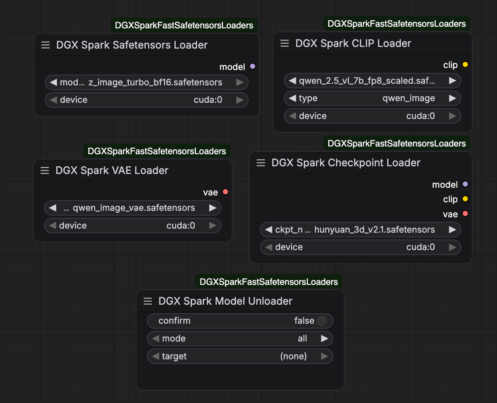

# ComfyUI-DGXSparkFastSafetensorsLoaders

> **Use at your own risk. No stability guarantee**

An extended version of [ComfyUI-DGXSparkSafetensorsLoader](https://github.com/phaserblast/ComfyUI-DGXSparkSafetensorsLoader) by [Phaserblast](https://github.com/phaserblast). This repo adds more nodes to support drop-in alternatives for Checkpoint Loader, CLIP Loader and VAE Loader, as well as a Model Unloader to free VRAM without the need to restart the server.

This custom node collection loads `.safetensors` model files into ComfyUI using the [fastsafetensors](https://github.com/foundation-model-stack/fastsafetensors) library, which performs fast, zero-copy transfers from storage directly to VRAM via NVIDIA GPUDirect. It is optimized for the NVIDIA DGX Spark's unified memory architecture, where the standard Hugging Face `safetensors` library can be slow and may transiently use up to 2× the model's size in RAM during loading.

In my workflows with Qwen Image Edit, it reduces loading time to ~5s total.

## Nodes

| Node | Description |
|---|---|
| **DGX Spark Safetensors Loader** | Loads a diffusion model (UNet / DiT) from `diffusion_models/` |
| **DGX Spark Checkpoint Loader** | Loads a full checkpoint (model + CLIP + VAE) from `checkpoints/` |
| **DGX Spark CLIP Loader** | Loads a CLIP / text encoder from `text_encoders/` |
| **DGX Spark Dual CLIP Loader** | Loads and combines two text encoders like ComfyUI's built-in Dual CLIP Loader |
| **DGX Spark VAE Loader** | Loads a VAE from `vae/` and also supports `vae_approx`, TAESD variants, `pixel_space`, and audio VAEs |
| **DGX Spark Latent Upscale Model Loader** | Loads models from `latent_upscale_models/` for ComfyUI latent upscaler workflows |
| **DGX Spark Model Unloader** | Explicitly frees fastsafetensors GPU memory for a loaded model |

All loader nodes cache loaded models in a global registry so re-running a workflow does not reload the file from disk. The **DGX Spark Model Unloader** node allows explicit VRAM reclamation without restarting ComfyUI. This addresses the memory-management limitation present in the original implementation.

## Usage



`Safetensors Loader`, `Checkpoints Loader`, `CLIP Loader`, `Dual CLIP Loader`, `VAE Loader`, and `Latent Upscale Model Loader` behave similarly to their official counterparts, except that their memory are not managed by ComfyUI. Thus, you can directly replace the original loader(s) in your workflow with them as needed.

The VAE loader also covers the extra behaviors commonly used from `VAE Loader KJ`: `vae_approx` video TAEs, TAESD image VAEs, `pixel_space`, selectable VAE dtype, and Lightricks audio VAE checkpoints.

If you want to unload models loaded by these fastsafetensors loaders, add a `Model Unloader` to your workflow, enable `confirm` and run the unloader node. To unload certain model, you should change `mode` to `selected` and choose your target model in `target`. You may need to refresh your page for loaded models to appear in the drop-down menu.

## Installation

```bash
cd ComfyUI/custom_nodes
git clone https://github.com/redstonewhite/ComfyUI-DGXSparkFastSafetensorsLoaders.git
```

Install the dependency (activate your venv first if applicable):

```bash
pip install fastsafetensors
```

Restart ComfyUI. The nodes appear in the **loaders** category.

## Notes

- Tested with `--disable-mmap` and `--gpu-only` flags, though they might be unnecessary and irrelevant.
- Should support quantized model compared to Phaserblast's implementation. If you encounter any problem, please raise an issue.

## Known Issues

- ~~All loaders except Safetensor Loader will double the memory usage. But they do significantly reduce the model loading time.~~ Fixed.

## Acknowledgements

Original `DGXSparkSafetensorsLoader` node and idea by [Phaserblast](https://github.com/phaserblast) — [ComfyUI-DGXSparkSafetensorsLoader](https://github.com/phaserblast/ComfyUI-DGXSparkSafetensorsLoader), licensed under the Apache License 2.0.


## Custom Loader in Workflow?

If your workflow contains custom nodes that does not support an external loader, you may try the following to integrate `fastsafetensors` to your ComfyUI.

1. Go to `/path/to/your/ComfyUI`, find `utils.py` under `comfy`. Open it, and make the following edit as noted:

```python
def load_torch_file(ckpt, safe_load=False, device=None, return_metadata=False):
    if device is None:
        device = torch.device("cpu")
    metadata = None
    if ckpt.lower().endswith(".safetensors") or ckpt.lower().endswith(".sft"):
        try:
            if comfy.memory_management.aimdo_enabled:
                sd, metadata = load_safetensors(ckpt)
                if not return_metadata:
                    metadata = None
            else:
                # =========== Begin Insertion ===========
                with fastsafe_open(filenames=[ckpt], nogds=False, device=device) as f:
                    sd = {}
                    for k in f.keys():
                        tensor = f.get_tensor(k).clone().detach()
                        sd[k] = tensor
                    if return_metadata:
                        metadata = f.metadata()
                # ============ End Insertion ============

                # ======= Comment Out Followings =======
                # with safetensors.safe_open(ckpt, framework="pt", device=device.type) as f:
                #     sd = {}
                #     for k in f.keys():
                #         tensor = f.get_tensor(k)
                #         if DISABLE_MMAP:  # TODO: Not sure if this is the best way to bypass the mmap issues
                #             tensor = tensor.to(device=device, copy=True)
                #         sd[k] = tensor
                #     if return_metadata:
                #         metadata = f.metadata()
                # ======= Comment Out Above =======
        
        # ========== Rest Untouched ===========
        except Exception as e:
            if len(e.args) > 0:
                message = e.args[0]
                if "HeaderTooLarge" in message:
                    raise ValueError("{}\n\nFile path: {}\n\nThe safetensors file is corrupt or invalid. Make sure this is actually a safetensors file and not a ckpt or pt or other filetype.".format(message, ckpt))
                if "MetadataIncompleteBuffer" in message:
                    raise ValueError("{}\n\nFile path: {}\n\nThe safetensors file is corrupt/incomplete. Check the file size and make sure you have copied/downloaded it correctly.".format(message, ckpt))
            raise e
        # And more ...
```

The above code is not fully tested, but works fine on my machine. USE THEM AT YOUR OWN RISK
